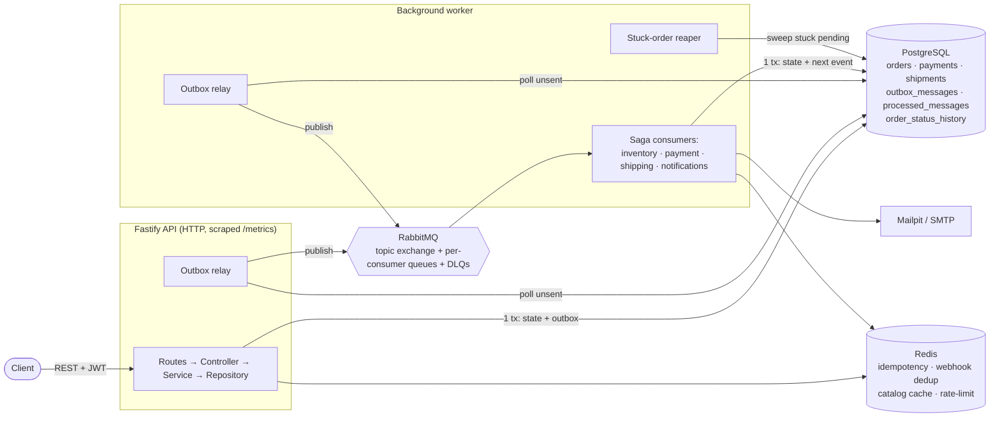

# Architecture

An event-driven **choreography saga** over a Fastify modular monolith. The HTTP API stays thin
and fast: it commits state + an outbox event in one transaction and returns immediately. A
background worker hosts the async consumers that carry the order through its lifecycle. Every
state change is written in the **same transaction** as the event it emits (Transactional
Outbox), so events are never lost and never orphaned.

## Component map

## Why the outbox + relay

A naive "write to DB, then publish to the broker" is a dual write: a crash between the two
loses the event. Instead the API/consumer writes the domain row **and** an `outbox_messages`
row in one ACID transaction. A relay polls unpublished rows (`FOR UPDATE SKIP LOCKED`, so it
runs safely in both the API and worker processes) and publishes them, stamping `published_at`.
Delivery is **at-least-once** → every consumer is **idempotent**.

## Idempotency, three layers

| Concern                 | Mechanism                                                                                |
| ----------------------- | ---------------------------------------------------------------------------------------- |
| Consumer redelivery     | `processed_messages (consumer, event_id)` composite-PK insert inside the handler tx      |
| HTTP client retries     | `Idempotency-Key` header → Redis marker + stored response (`src/plugins/idempotency.ts`) |
| Payment webhook replays | provider event id → Redis fast-path + `processed_messages` durable backstop              |

State transitions use **compare-and-set** (`UPDATE … WHERE status = <from>`) so a duplicate or a
racing writer updates zero rows and no-ops — a terminal order can never be revived.

## Processes

- **API** (`src/server.ts` → `src/app.ts`): HTTP, JWT, validation, the synchronous slice of the
  saga (order create, payment webhook, cancel/refund), plus a relay. Prometheus scrapes its
  `/metrics`.
- **Worker** (`src/workers/worker.ts`): one channel per consumer (independent prefetch), plus a
  relay and the reaper. Consumers: `inventory` (reserve), `payment-create`, `mock-provider`,
  `payment-complete`, `payment-compensate`, `shipping`, `notifications`, `email`.

## Related docs

- [event-flow.md](./event-flow.md) — the happy-path event graph.
- [state-machine.md](./state-machine.md) — order / payment / shipment machines.
- [compensation.md](./compensation.md) — failure & compensation paths.
- [tech-stack.md](./tech-stack.md) — stack + rationale.
