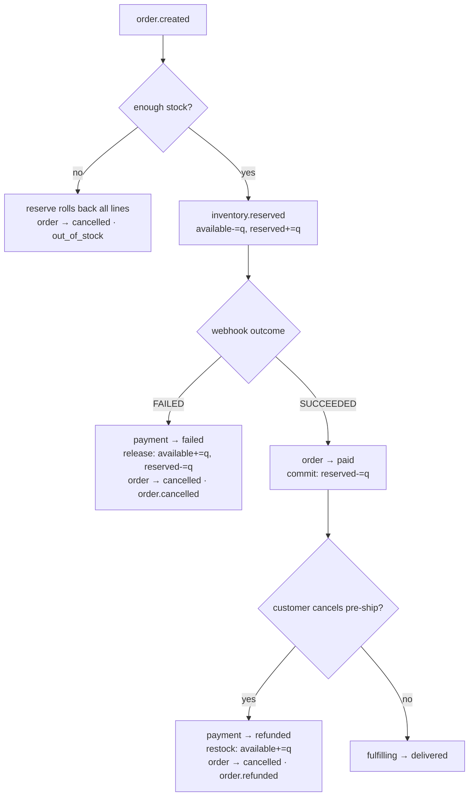

# Compensation

A choreography saga has no central coordinator, so failure handling is **compensating actions**:
each step knows how to undo the reservation it depends on. All stock math goes through the
guarded helpers in `inventory-repository.ts` (`WHERE stock_reserved >= q` / non-negative CHECK
constraints), so a compensation can never over-credit stock or double-release.

## The three failure paths

## Stock accounting

| Step                             | available | reserved | Guard                                                |
| -------------------------------- | --------- | -------- | ---------------------------------------------------- |
| Reserve                          | −q        | +q       | `WHERE available >= q` (all-or-nothing across lines) |
| Commit (paid)                    | —         | −q       | `WHERE reserved >= q`                                |
| Release (payment failed)         | +q        | −q       | `WHERE reserved >= q`                                |
| Restock (refund of a paid order) | +q        | —        | reserved already 0 at commit time                    |

Release vs restock differ deliberately: a payment-failed order still holds `reserved` stock (undo
both columns), whereas a refunded order already **committed** the reservation (`reserved` is 0), so
only `available` is credited back.

## Race safety: cancel vs the shipping worker

The HTTP cancel handler and the timer-driven shipping worker are separate processes both mutating
`orders.status`. Both use **compare-and-set**, and shipment creation is gated on _winning_ the
order CAS `paid → fulfilling` first (which takes the order row lock). So exactly one of
{cancel, ship} wins:

- Cancel wins → order `cancelled` + refund/restock; the shipping consumer's CAS finds a
  non-`paid` order, creates no shipment, schedules no advances.
- Ship wins → order `fulfilling`; a subsequent cancel's CAS finds a non-`paid`/non-`pending`
  order → **409**, no refund.

## Idempotent compensation

Every compensating consumer is keyed by `processed_messages (consumer, event_id)` and guarded by
CAS, so a redelivered `payment.failed` (or a duplicate cancel) releases stock and cancels the
order **once** — never a double-release. The two end-to-end tests
(`e2e-happy-path`, `e2e-compensation`) assert the final states and `correlationId == orderId`
across every emitted event.
