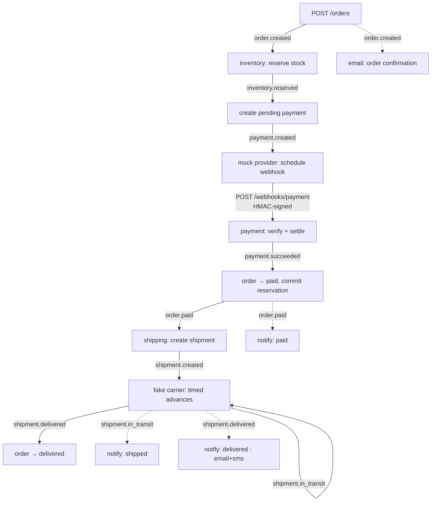
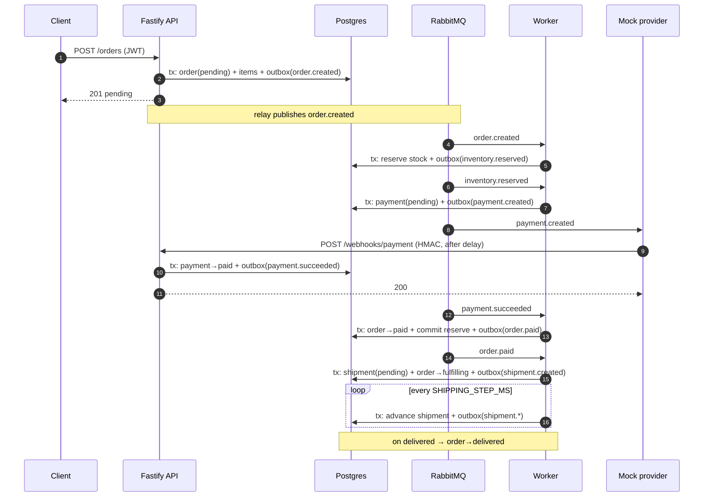

# Event Flow

The happy path from checkout to delivery, as a chain of outbox events. Every event carries a
`correlationId = orderId` and a stable `eventId`; consumers dedupe on `eventId` and each emits
the next event in the **same transaction** as the state change.

## Event graph (happy path)

Solid arrows = state-advancing saga steps. Dashed arrows = fan-out notifications (the same
event is consumed independently by the notifications consumer; a topic exchange delivers a copy
to every bound queue).

## Sequence (place → deliver)

## Events

| Event                                                                | Emitted by                                                    | Consumed by                               |
| -------------------------------------------------------------------- | ------------------------------------------------------------- | ----------------------------------------- |
| `order.created`                                                      | POST /orders (API)                                            | inventory, email                          |
| `inventory.reserved`                                                 | inventory consumer                                            | payment-create                            |
| `payment.created`                                                    | payment-create                                                | mock provider                             |
| `payment.succeeded` / `payment.failed`                               | payment webhook (API)                                         | payment-complete / payment-compensate     |
| `order.paid`                                                         | payment-complete                                              | shipping, notifications                   |
| `shipment.created` / `ready_for_pickup` / `in_transit` / `delivered` | shipping                                                      | notifications (`in_transit`, `delivered`) |
| `order.cancelled`                                                    | inventory (out-of-stock), payment-compensate, cancel endpoint | notifications                             |
| `order.refunded`                                                     | cancel endpoint (paid order)                                  | notifications                             |

See [compensation.md](./compensation.md) for the failure branches.
