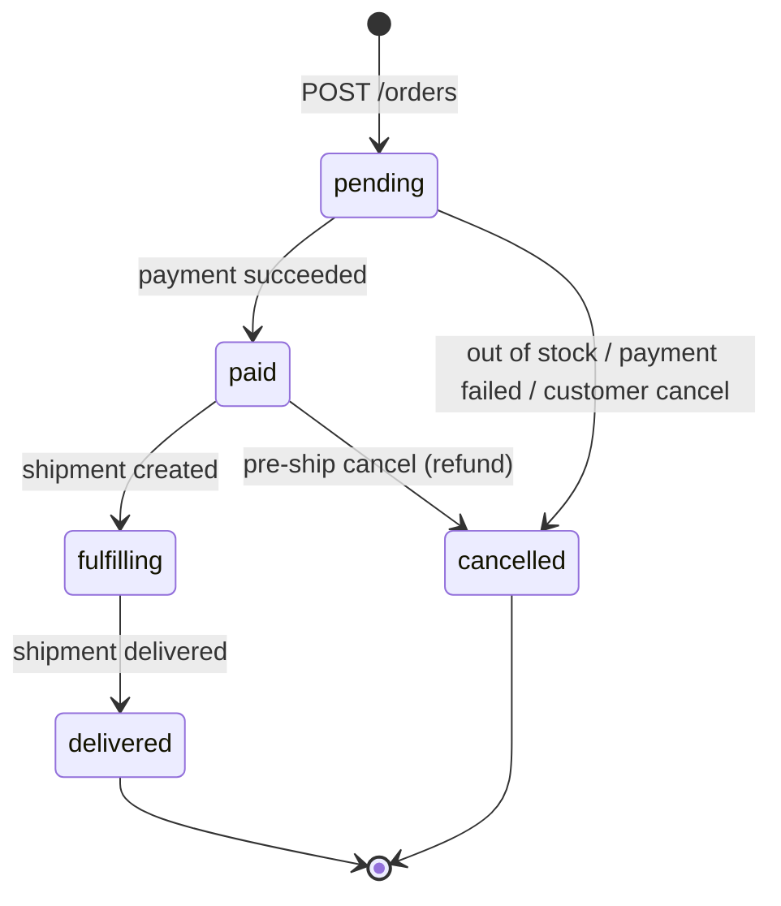
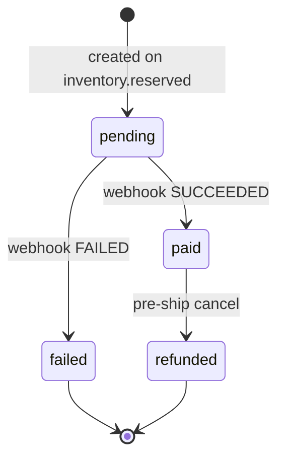
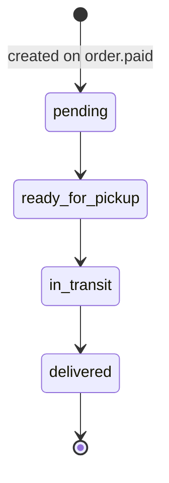

# State Machines

Each aggregate has a single source-of-truth status machine (`order-status.ts`,
`payment-status.ts`, `shipment-status.ts`). Terminal states accept no further transitions, and
every change is applied with a **compare-and-set** `UPDATE … WHERE status = <from>` so illegal or
racing transitions update zero rows and no-op. Every order transition also appends a row to
`order_status_history` (from → to, reason) in the same transaction.

## Order

`cancelled → paid` is intentionally absent: a late `payment.succeeded` can never revive a
cancelled order (the CAS on `status = 'pending'` matches nothing).

## Payment

Two independent guards keep the webhook idempotent: `provider_event_id` dedup (same event twice)
and the CAS on `pending` (a distinct FAILED-then-SUCCEEDED pair can't flip a settled payment).

## Shipment

Linear and forward-only. The fake carrier advances one step per `SHIPPING_STEP_MS`; the admin
`PATCH /shipments/:id/status` advances through the exact same machine + CAS (also the manual
recovery path if an in-process timer is lost on restart).
