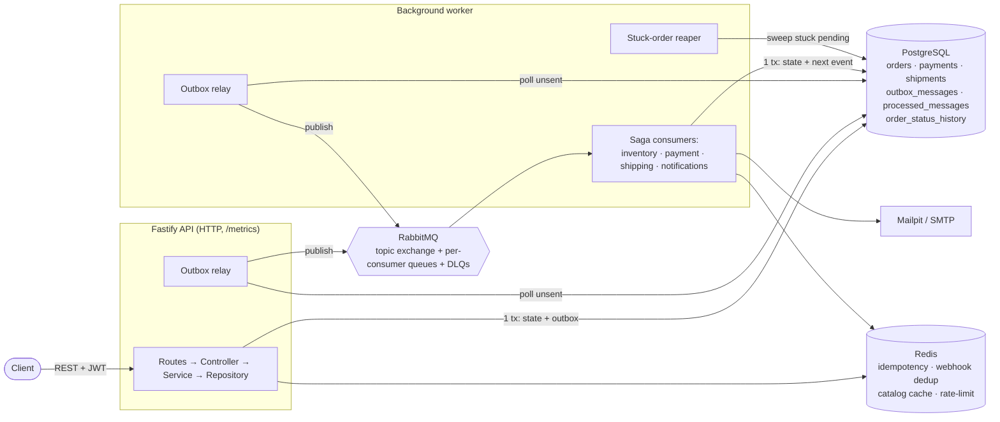
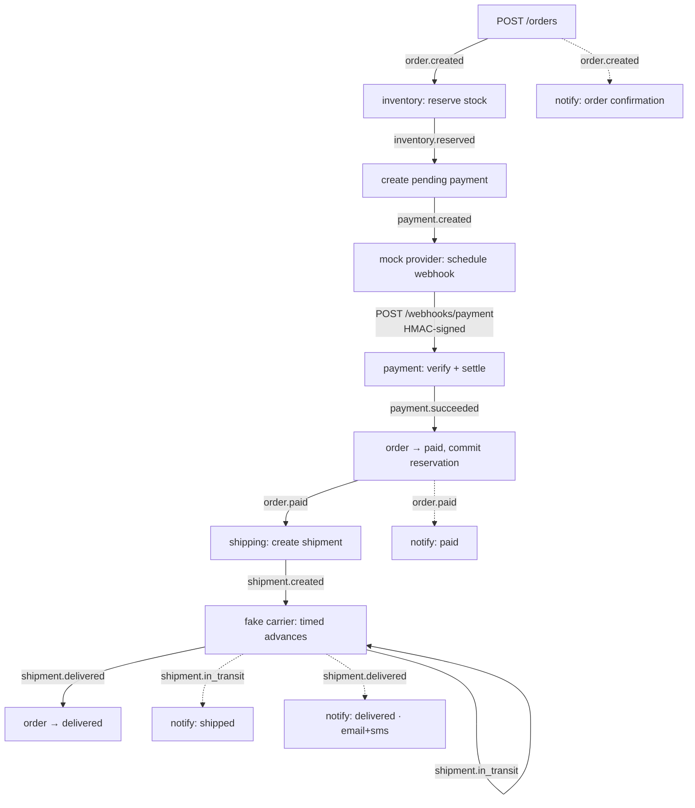
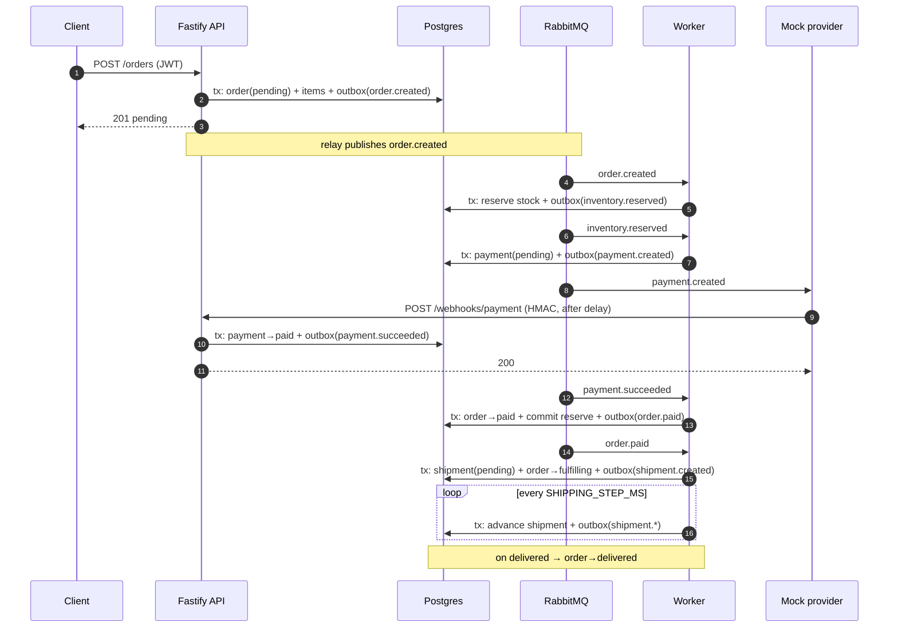
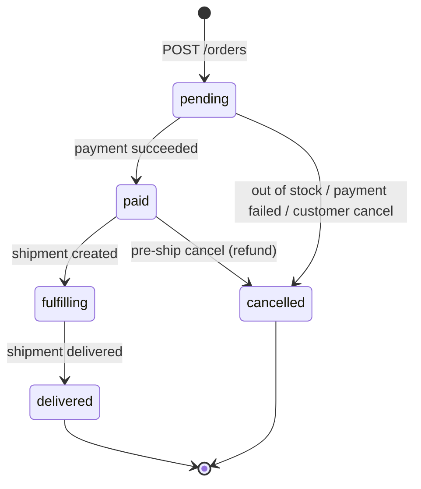
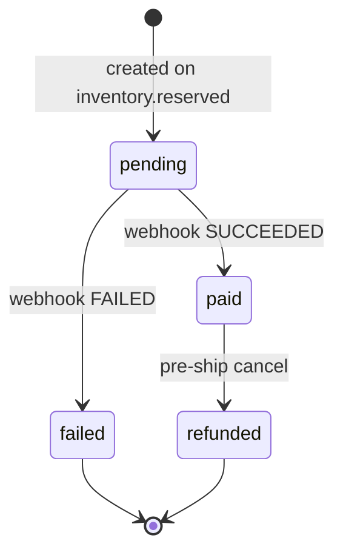
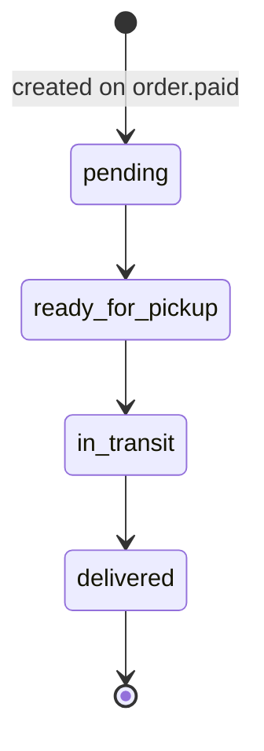
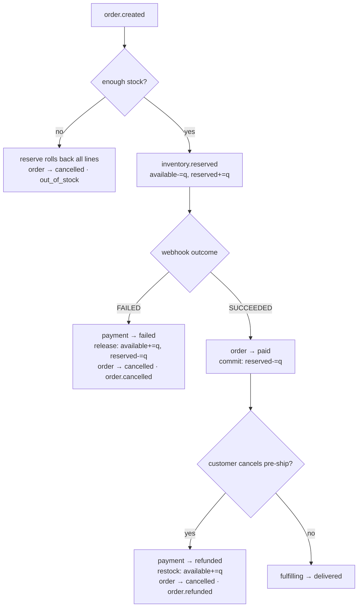

# System Architecture

This document describes the core architecture: component interactions, the transactional outbox pattern, idempotency layers, saga event flow, state machines, and compensation strategies.

## Component Overview

The system is event-driven and distributed across two processes, one container image:



### Process Responsibilities

| Process    | Role         | Entry Point             | Responsibilities                                         |
| ---------- | ------------ | ----------------------- | -------------------------------------------------------- |
| **API**    | Synchronous  | `src/server.ts`         | HTTP routes, state writes, outbox relay (poll + publish) |
| **Worker** | Asynchronous | `src/workers/worker.js` | Saga consumers (async handlers), relay, reaper           |

Both processes access the same database and RabbitMQ broker; the relay in each uses `FOR UPDATE SKIP LOCKED` to safely coordinate.

## Transactional Outbox (Core Pattern)

The Transactional Outbox is the architectural foundation ensuring **zero event loss** and **safe retries**.

### Problem It Solves

A naive approach (write to DB, then publish to broker) creates a dual-write consistency gap:

```
[Client] POST /orders
  ↓
[API] INSERT order into PostgreSQL ✅
[API] PUBLISH order.created to RabbitMQ ❌ (crashes before this)
  ↓
Event lost; order created but notifications never sent
```

### Solution: Atomic Write

State and event are written in **one ACID transaction**:

```
[Client] POST /orders
  ↓
[API] BEGIN TRANSACTION
  INSERT order (status=pending)
  INSERT outbox_messages (type=order.created, payload=order, published_at=NULL)
COMMIT ✅
  ↓
[API] HTTP 201 Created (returned immediately)
  ↓
[Outbox Relay] Poll for unpublished rows
  ↓
UPDATE outbox_messages SET published_at=<now> WHERE published_at IS NULL
PUBLISH order.created to RabbitMQ ✅
  ↓
[Worker] Consumes order.created, processes in transaction
  ↓
Insert order + outbox events in same transaction
```

**Guarantees:**

- Event is either in the database (published_at = NULL) or in RabbitMQ (published_at = <timestamp>)
- Relay can safely re-run (idempotent) — already-published rows are skipped
- Broker downtime does not lose events — relay retries on reconnect

### Outbox Table Schema

```sql
CREATE TABLE outbox_messages (
  id UUID PRIMARY KEY,
  event_type TEXT NOT NULL,
  payload JSONB NOT NULL,
  correlation_id UUID NOT NULL,
  published_at TIMESTAMP,
  created_at TIMESTAMP NOT NULL
);
CREATE INDEX ON outbox_messages(published_at) WHERE published_at IS NULL;
```

The relay queries: `SELECT * FROM outbox_messages WHERE published_at IS NULL FOR UPDATE SKIP LOCKED`.

### Relay Implementation

Runs in both API and worker processes:

1. Poll unpublished rows (`published_at IS NULL`)
2. For each batch, atomically `UPDATE` the row to set `published_at`
3. Publish to RabbitMQ
4. If broker fails, the row remains unpublished; relay retries on next cycle

The `FOR UPDATE SKIP LOCKED` ensures:

- If both API and worker relays are running, each takes a different batch (no duplicate publishes)
- If a relay crashes, another will pick up the unpublished rows on restart

**Delivery guarantee:** At-least-once (same message may be delivered multiple times).

## Idempotency (Three Layers)

Since delivery is at-least-once, every consumer must be idempotent. The system has three independent idempotency mechanisms for different failure origins:

### Layer 1: Consumer Dedup (RabbitMQ Redelivery)

**Scope:** Protect against RabbitMQ redelivering the same message within a consumer.

**Mechanism:** Before processing an event, insert `(consumer_name, event_id)` as a composite primary key:

```typescript
async function handleOrderCreated(event: OrderCreatedEvent) {
  try {
    // Insert dedup marker
    await db.insert(processedMessages).values({
      consumer: 'inventory-reserve',
      eventId: event.id,
      processedAt: new Date(),
    });
  } catch (err) {
    if (err.code === '23505') {
      // PK violation
      // Already processed this event
      return;
    }
    throw err;
  }

  // Safe to process now
  await reserveInventory(event.orderId, event.items);
}
```

**Guarantee:** A redelivered `order.created` is processed exactly once; inventory is reserved exactly once.

### Layer 2: HTTP Idempotency-Key (Client Retries)

**Scope:** Protect against client retrying a failed request (e.g., timeout on POST /orders).

**Mechanism:** Client includes `Idempotency-Key: <UUID>` header; server caches the response:

```typescript
// In idempotency plugin
app.register(idempotencyPlugin, {
  redis, // Store in Redis
  namespace: 'idempotency',
});

// Route
routes.post('/orders', async (req, reply) => {
  // Plugin intercepts: check Redis for <Idempotency-Key>
  // If found, return cached response
  // If not found, process request, cache response, return
  const order = await service.createOrder(req.body, req.user);
  return reply.code(201).send(order);
});
```

**Guarantee:** A client retrying POST /orders with the same Idempotency-Key always gets the same response.

### Layer 3: Payment Webhook Dedup (Provider Replay)

**Scope:** Protect against payment provider replaying a webhook (e.g., Stripe retries failed webhooks).

**Mechanism:** Provider includes a stable `event_id` (e.g., Stripe event ID). Handler checks Redis first:

```typescript
async function handlePaymentWebhook(req: FastifyRequest) {
  const { event_id, type, data } = req.body;

  // Fast path: Redis dedup
  const cacheKey = `webhook:${event_id}`;
  const cached = await redis.get(cacheKey);
  if (cached) return reply.code(200).send({ status: 'already-processed' });

  // Verify HMAC signature
  if (!verifyHMAC(req.body, req.headers['x-signature'], PAYMENT_WEBHOOK_SECRET)) {
    throw new UnauthorizedError('Invalid signature');
  }

  // Process in transaction
  const result = await db.transaction(async (tx) => {
    // Durable dedup: processed_messages
    try {
      await tx.insert(processedMessages).values({
        consumer: 'payment-webhook',
        eventId: event_id,
      });
    } catch {
      // Already processed
      return { processed: false };
    }

    // Update payment status
    const payment = await tx
      .update(payments)
      .set({ status: PAYMENT_STATUS.PAID, ... })
      .where(eq(payments.id, data.payment_id))
      .returning();

    // Emit next event
    await tx.insert(outboxMessages).values({
      eventType: 'payment.succeeded',
      payload: payment,
    });

    return { processed: true };
  });

  // Cache in Redis (TTL: 24h)
  await redis.setex(cacheKey, 86400, JSON.stringify(result));

  return reply.code(200).send(result);
}
```

**Guarantee:** A webhook provider replaying the same event is safe; payment is settled exactly once.

## Saga Event Flow (Happy Path)

The order progresses through a series of events. Each event is emitted atomically with the state change that produced it.



**Legend:**

- **Solid arrows:** State-advancing saga steps (consumers run sequentially)
- **Dashed arrows:** Notifications (fan-out from topic exchange; independent of saga progression)

### Event Sequence (Place → Deliver)



### Event Table

| Event                                                                | Emitted by                                           | Consumed by                           | Purpose                                   |
| -------------------------------------------------------------------- | ---------------------------------------------------- | ------------------------------------- | ----------------------------------------- |
| `order.created`                                                      | POST /orders                                         | inventory, notifications              | Trigger reserve + confirm email           |
| `inventory.reserved`                                                 | inventory consumer                                   | payment-create                        | Create pending payment                    |
| `payment.created`                                                    | payment-create                                       | mock provider                         | Request payment processing                |
| `payment.succeeded` / `payment.failed`                               | payment webhook (API)                                | payment-complete / payment-compensate | Settle payment or fail order              |
| `order.paid`                                                         | payment-complete                                     | shipping, notifications               | Create shipment + paid email              |
| `shipment.created` / `ready_for_pickup` / `in_transit` / `delivered` | shipping consumer                                    | notifications (in_transit, delivered) | Track delivery + shipped/delivered emails |
| `order.cancelled`                                                    | inventory (OOS), payment-compensate, cancel endpoint | notifications                         | Cancellation email                        |
| `order.refunded`                                                     | cancel endpoint (paid order)                         | notifications                         | Refund email                              |

## State Machines

Every aggregate (order, payment, shipment) has a single source-of-truth state machine. Transitions use **compare-and-set** (`UPDATE … WHERE status = <from>`) to prevent illegal transitions.

### Order State Machine



**Guarantee:** A cancelled order can never be revived, even if a late `payment.succeeded` arrives. The CAS on `status = 'pending'` will match zero rows and no-op.

### Payment State Machine



**Idempotency guards:**

1. `provider_event_id` dedup in Redis (same event twice)
2. CAS on `pending` — a `FAILED`-then-`SUCCEEDED` pair can't flip a settled payment

### Shipment State Machine



Linear and forward-only. The fake carrier advances one step per `SHIPPING_STEP_MS`; the admin `PATCH /shipments/:id/status` advance also uses CAS.

## Compensation & Failure Paths

When a step fails, the saga triggers compensating actions. There is no central coordinator; each consumer knows how to undo its reservation.



### Stock Accounting

All stock mutations are guarded:

| Step                         | available | reserved | Guard                                  | SQL                           |
| ---------------------------- | --------- | -------- | -------------------------------------- | ----------------------------- |
| **Reserve**                  | −q        | +q       | `WHERE available ≥ q` (all-or-nothing) | `UPDATE WHERE available >= q` |
| **Commit** (paid)            | —         | −q       | `WHERE reserved ≥ q`                   | `UPDATE WHERE reserved >= q`  |
| **Release** (payment failed) | +q        | −q       | `WHERE reserved ≥ q`                   | `UPDATE WHERE reserved >= q`  |
| **Restock** (refund)         | +q        | —        | reserved already 0 at commit time      | (no guard needed)             |

**Example (reserve with guard):**

```sql
UPDATE product_stock
SET available = available - $1, reserved = reserved + $1
WHERE product_id = $2
  AND available >= $1    -- All-or-nothing: either reserve all items or none
RETURNING available, reserved;
```

If available < q, the row is not updated; the consumer detects the result is empty and cancels the order.

**Release vs Restock differ deliberately:**

- **Release (payment failed):** Still holds `reserved` stock → undo both columns
- **Restock (refund of paid order):** Already **committed** the reservation (`reserved` is 0) → only credit `available`

### Race Safety: Cancel vs Shipping Worker

Both the HTTP cancel endpoint and the timer-driven shipping worker mutate `orders.status`. Both use CAS, so exactly one wins:

1. **Cancel wins:** `order.cancelled` + refund/restock; shipping worker's CAS finds non-`paid` order → creates no shipment
2. **Ship wins:** `order.fulfilling`; subsequent cancel's CAS finds non-`paid`/non-`pending` order → **409 Conflict**, no refund

The row lock on the CAS (`UPDATE … WHERE status = …`) serializes the writers.

### Idempotent Compensation

Every compensating consumer is keyed by `processed_messages (consumer, event_id)` PK and guarded by CAS, so a redelivered `payment.failed` releases stock and cancels the order **exactly once** — never double-release.

## Key Design Invariants

1. **State + Event in one transaction** — Outbox pattern, zero event loss
2. **At-least-once delivery** — Relay guarantees; consumers must be idempotent
3. **Compare-and-set transitions** — No blind updates; prevents illegal state changes
4. **Dedup via processed_messages** — Per-consumer idempotency via composite PK
5. **HTTP Idempotency-Key cache** — Fast response to retried client requests
6. **HMAC webhook signatures** — Verify origin before processing
7. **Graceful degradation** — Broker downtime ≠ event loss (outbox holds them)
8. **No distributed locks** — Database row locks provide serialization
9. **Audit trail via events + order_status_history** — Full trace of order progression
10. **Correlation IDs across async boundaries** — W3C trace context carried in outbox rows

## Performance Characteristics

- **API response latency:** ≤100ms (state write + outbox only, no broker wait)
- **Saga completion:** O(N) where N = number of consumers (sequential per order)
- **Idempotency lookups:** O(1) via Redis (webhook dedup) + database PK lookup (consumer dedup)
- **Outbox relay:** Batches unpublished rows, configurable poll interval
- **Scalability:** API and Worker scale independently; relay uses SKIP LOCKED for coordination

## Observability

- **Distributed tracing:** W3C trace context in HTTP headers and outbox rows; OpenTelemetry propagates across RabbitMQ
- **Metrics:** Saga step counters (orders pending → paid → delivered), consumer latency histograms
- **Logs:** Structured Pino JSON with correlationId tying all steps together
- **Error tracking:** Sentry captures exceptions with full context
